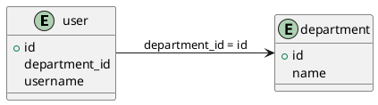

# MyBatis SQL Relationship Analyzer
# MyBatis SQL 关系分析工具


[English](#overview) | [中文](#概述)

<p align="center">
  
</p>

## Overview

This tool analyzes SQL statements in MyBatis XML files within SpringBoot projects to automatically extract database table relationships. It features a web interface for specifying directories to analyze, generates interactive ER diagrams using JointJS, structured relationship lists, supports copying PlantUML results, and renders results directly in the interface.

## 概述

本工具用于分析 SpringBoot 项目中 MyBatis XML 文件中的 SQL 语句，自动提取数据库表关联关系，支持通过 Web 界面指定目录进行分析，使用 JointJS 生成可交互的 ER 图表和结构化关系列表，支持将plantuml结果复制出来，以及支持在界面直接渲染出结果。

---

## 🌟 Key Features / 核心功能

### 1. SQL Relationship Analysis / SQL 关联关系分析
- **Multiple Scenario Coverage / 多场景覆盖**  
  Supports parsing of various association patterns including `JOIN` statements, `WHERE` clauses, and nested queries.  
  支持 `JOIN` 语句、`WHERE` 子句、嵌套查询等多种关联模式解析。
  
- **Dynamic Tag Processing / 动态标签处理**  
  Automatically filters MyBatis dynamic tags such as `<if>`, `<foreach>`, etc.  
  自动过滤 `<if>`、`<foreach>` 等 MyBatis 动态标签。
  
- **Precise Alias Recognition / 别名精准识别**  
  Automatically resolves table alias mapping relationships to avoid misidentification (e.g., `user as u` → real table name `user`).  
  自动解析表别名映射关系，避免误识别（如 `user as u` → 真实表名 `user`）。

- **Subquery Analysis / 子查询分析** 🆕  
  Extracts and analyzes relationships from subqueries to provide a complete view of database interactions.  
  提取并分析子查询中的关系，提供完整的数据库交互视图。

- **Smart Primary/Foreign Key Detection / 智能主键/外键检测** 🆕  
  Automatically identifies potential primary and foreign key relationships based on naming patterns and usage context.  
  根据命名模式和使用上下文自动识别潜在的主键和外键关系。

### 2. Visualization / 可视化展示
- **Interactive ER Diagram / 交互式 ER 图表** 🆕  
  New in v1.2: Interactive Entity-Relationship diagrams rendered directly in the browser using JointJS.  
  v1.2新功能：使用 JointJS 直接在浏览器中渲染交互式实体关系图表。  
  Features include:  
  功能包括：
  - Drag-and-drop entity positioning / 实体拖放定位
  - Canvas panning with mouse hold / 长按鼠标平移画布 🆕
  - Zoom in/out capabilities / 缩放功能
  - Automatic layout optimization / 自动布局优化
  - Field relationship visualization / 字段关系可视化
  - Dark mode support / 暗黑模式支持
  
- **Smart Chart Layout / 智能图表布局**  
  Automatically applies layout engine to optimize initial node positions and prevent overlapping.  
  自动应用布局引擎，优化节点初始位置防止重叠。  
  Supports manual dragging to adjust node positions.  
  支持手动拖动调整节点位置。  
  Frontend rendering of scanned tables and relationship results with automatic layout.  
  前端支持渲染出扫描的表、关系结果，并自动进行布局，优化节点初始位置防止重叠。
  
- **Dual View Presentation / 双视图呈现**  
  **Chart View / 图表视图**: Interactive ER diagram with draggable entities + relationship lines.  
  **List View / 列表视图**: Relationship details + file source information.

- **Dark Mode Support / 暗黑模式支持**  
  Switch between light and dark themes for comfortable viewing in different environments.  
  在不同环境下提供舒适的浏览体验，支持在浅色和深色主题之间切换。

### 3. Data Normalization / 数据规范化
- **Unified Metadata Format / 统一元数据格式**  
  All table/field names are automatically converted to lowercase to eliminate case inconsistency issues.  
  所有表名/字段名自动转为小写，消除大小写不一致问题。
  
- **Duplicate Merging Mechanism / 重复合并机制**  
  Automatically merges table structure definitions with the same name while preserving association traces from different files.  
  自动合并同名表结构定义，保留不同文件的关联痕迹。

### 4. Export Options / 导出选项
- **Multiple Export Formats / 多种导出格式** 🆕  
  Support for exporting analysis results in CSV, JSON, Markdown, PlantUML, SVG, and PNG formats.  
  支持将分析结果导出为CSV、JSON、Markdown、PlantUML、SVG和PNG格式。
  
- **Relationship Documentation / 关系文档化** 🆕  
  Generate well-formatted Markdown documentation with entity descriptions and relationship tables.  
  生成格式良好的Markdown文档，包含实体描述和关系表格。

---

## 📋 Requirements / 环境要求

- Python 3.6+
- Web browser (Chrome/Firefox/Edge recommended)
- Internet connection (for PlantUML rendering)

## 🔧 Installation / 安装

1. **Clone the repository / 克隆代码库**
   ```bash
   git clone https://github.com/yourusername/mybatis-sql-xml-analyzer.git
   cd mybatis-sql-xml-analyzer
   ```

2. **Install dependencies / 安装依赖**
   ```bash
   pip install -r requirements.txt
   ```

## 🚀 Usage / 使用方法

### Starting the Service / 启动服务
```bash
# Basic startup / 基本启动
flask run --host=0.0.0.0 --port=5000

# Or with environment file / 或使用环境文件
python -m flask run --host=0.0.0.0 --port=5000
```

### Web Interface / Web 界面
1. **Access the application / 访问应用**  
   Open your browser and navigate to:  
   打开浏览器，访问：  
   ```
   http://localhost:5000
   ```

2. **Specify analysis path / 指定分析路径**  
   Enter the absolute path to your MyBatis mapper directory:  
   输入 MyBatis mapper 目录的绝对路径：  
   ```
   /project/src/main/resources/mapper
   ```

3. **View analysis results / 查看分析结果**  
   - **Chart View / 图表视图**: Interactive JointJS ER diagram with draggable entities  
     使用 JointJS 的交互式 ER 图表，支持拖拽实体
   - **List View / 列表视图**: Expandable relationship details  
     可展开查看关联 SQL 片段
   - **PlantUML View / PlantUML 视图**: Traditional PlantUML code  
     传统的 PlantUML 代码
   - **Export Options / 导出选项**: PNG/SVG/CSV/JSON/Markdown formats  
     PNG/SVG/CSV/JSON/Markdown 五种格式

4. **ER Diagram Interaction / ER 图表交互** 🆕  
   - **Drag entities**: Reposition tables for better visualization  
     拖动实体：重新定位表格以获得更好的可视化效果
   - **Canvas panning**: Hold left mouse button on empty areas to pan the canvas  
     画布平移：在空白区域长按鼠标左键来平移整个画布
   - **Zoom controls**: Zoom in/out and fit content to view  
     缩放控制：放大/缩小和适应内容到视图
   - **Download diagrams**: Export as SVG or PNG directly from the browser  
     下载图表：直接从浏览器导出为 SVG 或 PNG

5. **Toggle Dark Mode / 切换暗黑模式**  
   Click the theme toggle button in the top-right corner to switch between light and dark themes.  
   点击右上角的主题切换按钮，在浅色和深色主题之间切换。

---

## 📊 Output Examples / 输出示例

### Interactive ER Diagram / 交互式 ER 图表 🆕
The interactive diagram allows you to:
- Drag entities to custom positions
- Zoom in/out for detailed view
- See field relationships with labels
- Export as SVG or PNG directly

交互式图表允许您：
- 将实体拖动到自定义位置
- 放大/缩小以获得详细视图
- 通过标签查看字段关系
- 直接导出为 SVG 或 PNG

### PlantUML Diagram Example / PlantUML 图表示例


### Relationship List Example / 关系列表示例
| Source Table | Source Field  | Target Table | Target Field | Source File               | FK Relationship |
|--------------|---------------|--------------|--------------|---------------------------|----------------|
| user         | department_id | department   | id           | UserMapper.xml (L23-L45)  | Yes            |
| order        | user_id       | user         | id           | OrderDao.xml (L12-L38)    | Yes            |

| 源表     | 源字段       | 目标表      | 目标字段 | 关联文件                 | 外键关系      |
|----------|--------------|-------------|----------|--------------------------|-------------|
| user     | department_id| department  | id       | UserMapper.xml (L23-L45) | 是           |
| order    | user_id      | user        | id       | OrderDao.xml (L12-L38)   | 是           |

### JSON Export Example / JSON导出示例 🆕
```json
{
  "entities": [
    {
      "name": "user",
      "fields": ["id", "username", "department_id"],
      "primary_key": "id"
    },
    {
      "name": "department",
      "fields": ["id", "name"],
      "primary_key": "id"
    }
  ],
  "relationships": [
    {
      "source_table": "user",
      "source_field": "department_id",
      "target_table": "department",
      "target_field": "id",
      "relationship_type": "JOIN",
      "source_file": "UserMapper.xml (L23-L45)",
      "is_potential_fk": true
    }
  ],
  "stats": {
    "total_sql_statements": 10,
    "total_relationships": 5,
    "total_entities": 4
  }
}
```

---

## 📚 Advanced Usage / 高级用法

### Command-Line Execution / 命令行执行
```bash
python cli_analyzer.py --path /path/to/mapper --output result.puml --json result.json --markdown result.md
```

### Configuration Options / 配置选项
Edit `.env` file to customize:
- `DEBUG_MODE=True/False` - Enable/disable debug logging
- `MAX_DEPTH=3` - Set maximum SQL parsing depth for nested queries
- `OUTPUT_DIR=./output` - Default directory for exported files
- `PLANTUML_SERVER=http://www.plantuml.com/plantuml/svg/` - PlantUML server URL

编辑 `.env` 文件进行自定义配置：
- `DEBUG_MODE=True/False` - 启用/禁用调试日志
- `MAX_DEPTH=3` - 设置嵌套查询的最大 SQL 解析深度
- `OUTPUT_DIR=./output` - 导出文件的默认目录
- `PLANTUML_SERVER=http://www.plantuml.com/plantuml/svg/` - PlantUML服务器URL

---

## 🔍 Troubleshooting / 故障排除

### Common Issues / 常见问题
- **No tables found / 未找到表**: Ensure your MyBatis XML files contain valid SQL queries
- **Rendering fails / 渲染失败**: Check your internet connection for PlantUML server access
- **Missing relationships / 缺少关系**: Complex or non-standard SQL might need manual review

---

## 🆕 What's New in v1.2.0 / 新版本1.2.0功能

- **Interactive ER Diagrams / 交互式ER图表**: Fully interactive entity-relationship diagrams rendered directly in the browser using JointJS.
- **Drag & Drop Interface / 拖拽式界面**: Reposition entities by dragging for custom layouts.
- **Canvas Panning / 画布平移**: Hold left mouse button on empty space to navigate large diagrams.
- **Zoom Controls / 缩放控制**: Zoom in/out and fit diagram to view for better visualization.
- **Direct SVG/PNG Export / 直接SVG/PNG导出**: Export diagrams directly from the browser without server-side rendering.
- **Field Relationship Labels / 字段关系标签**: Field names displayed on relationship lines for better understanding.
- **Dark Mode Improvements / 暗黑模式改进**: Enhanced dark mode support for diagrams with proper contrast.
- **Performance Optimization / 性能优化**: Faster diagram rendering with client-side processing.

---

## 🤝 Contributing / 贡献

Contributions are welcome! Please feel free to submit a Pull Request.
欢迎贡献！请随时提交 Pull Request。

1. Fork the repository
2. Create your feature branch (`git checkout -b feature/amazing-feature`)
3. Commit your changes (`git commit -m 'Add some amazing feature'`)
4. Push to the branch (`git push origin feature/amazing-feature`)
5. Open a Pull Request

---

## 📄 Dependencies / 依赖环境

```python
# requirements.txt
Flask==3.0.2
lxml==4.9.3
sqlparse==0.4.4
plantuml==0.3.0
python-dotenv==1.0.1
```

## 📜 License / 许可证

This project is licensed under the MIT License - see the LICENSE file for details.
本项目采用 MIT 许可证 - 有关详细信息，请参阅 LICENSE 文件。

---

## 👏 Acknowledgments / 致谢

- [PlantUML](https://plantuml.com/) - For diagram rendering
- [SQLParse](https://github.com/andialbrecht/sqlparse) - For SQL parsing capabilities
- All contributors and users of this tool

---

<p align="center">Made with ❤️ for database developers and designers</p>
<p align="center">为数据库开发人员和设计师精心打造</p>

## Windows可执行文件构建

本项目支持使用PyInstaller将应用程序打包为Windows可执行文件，使得用户无需安装Python和其他依赖即可运行。

### 构建步骤

1. 确保已安装所有依赖：
   ```
   pip install -r requirements.txt
   pip install pyinstaller
   ```

2. 运行构建脚本：
   ```
   python build_executable.py
   ```

3. 成功构建后，可执行文件位于 `dist/mybatis_sql_analyzer.exe`

### 使用可执行文件

1. 双击运行 `mybatis_sql_analyzer.exe`
2. 等待应用程序启动（会打开命令行窗口和浏览器）
3. 在浏览器中访问应用界面（通常为 http://localhost:5000）
4. 所有生成的输出文件将保存在可执行文件所在目录的 `output` 文件夹中

### 注意事项

- 首次启动时，Windows防火墙可能会提示是否允许网络访问，请选择"允许"
- 应用程序会在当前目录创建 `output` 文件夹用于存储生成的文件
- 关闭命令行窗口将停止应用程序

